# 🍍 Code Ananas

**AI-powered food expense & sustainability platform** — scan grocery receipts, track your budget, measure your carbon footprint, and share recipes with cooking friends.

> ⚠️ The source code falls under Code Ananas policy/NDA and can't be shared — this repo is a visual and architectural showcase instead.

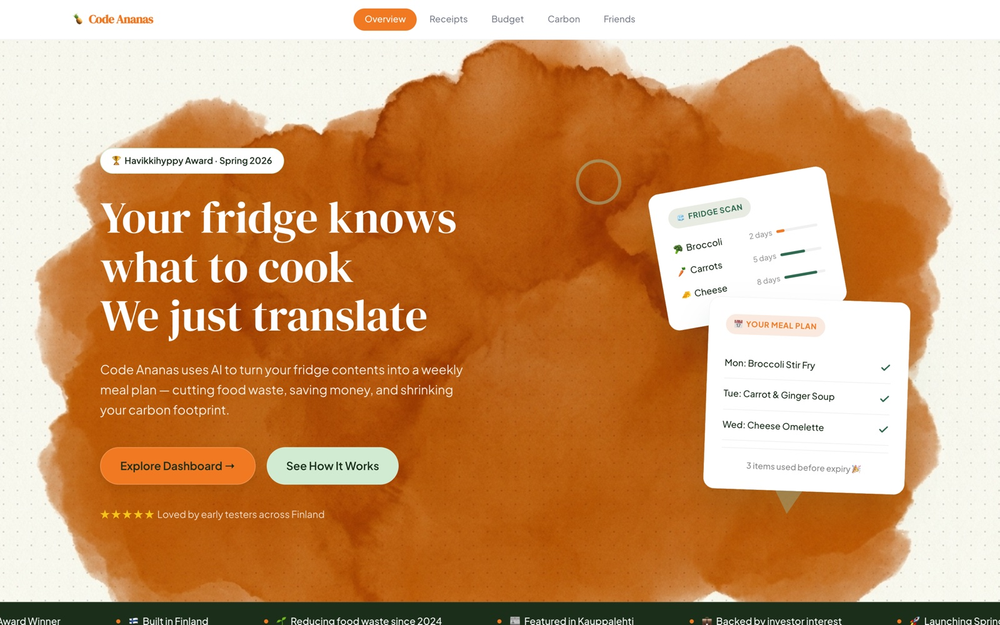

---

## What it does

Code Ananas turns a photo of your grocery receipt into structured, actionable data. One scan feeds three experiences at once: budget tracking, carbon footprint analysis, and a social cooking layer.

| Feature | Powered by |
|---|---|
| 📸 Receipt scanning (OCR + AI enrichment) | Azure AI Document Intelligence + Azure OpenAI |
| 💶 Monthly budget tracking | Azure Functions + shared SQLite |
| 🌍 Carbon footprint estimation | Express.js + LUKE FoodGWP v1.09 dataset |
| 👥 Friends & recipe sharing | Azure Functions |
| 🖥 Unified dashboard | Next.js (App Router) with a BFF proxy layer |

---

## System architecture

A monorepo of four independently runnable backend services behind one Next.js dashboard. The browser only ever talks to the dashboard — every backend call is proxied server-side.

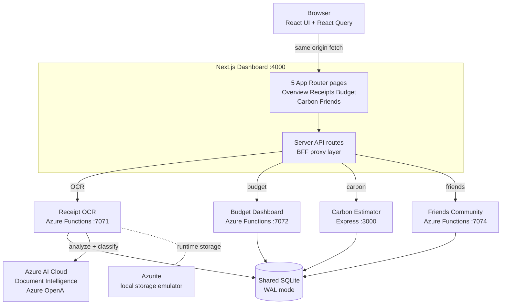

**Design decisions worth mentioning:**

- **Backend-for-Frontend proxy** — the browser never talks to a backend port directly. Same-origin Next.js route handlers forward requests server-side, which eliminates CORS entirely, keeps backend hostnames out of client bundles, and normalizes failures: a reachable-but-failing service passes through its upstream status, while an unreachable one becomes a clean `upstream_unreachable` JSON error instead of a raw network exception.
- **Scan-once, consume-many data layer** — one SQLite database behind a shared internal package feeds three services, running in WAL mode with busy-timeouts and retry-on-lock so concurrent services never block or corrupt each other.
- **One-command dev experience** — `npm run dev` first frees every port the platform needs, then boots Azurite (local Azure Storage emulator), all four services, and the dashboard concurrently with color-coded log streams. A one-time setup script reads a single root `.env` and generates each Azure Functions service's local settings, so credentials live in exactly one place.
- **Deterministic sustainability math** — carbon numbers come from a published, CC BY 4.0-licensed national research dataset rather than an LLM, so the same receipt always produces the same auditable result (more on this below).

---

## Features

### 📸 Receipt Scanning Pipeline

The receipt scanner turns a photographed grocery receipt into structured, per-item spending and food data. It was built to survive the messiest input in the project: crumpled, low-contrast **Finnish** supermarket receipts full of abbreviations, multi-buy discount lines, deposit rows, and inconsistent date formats.

Here it is parsing a real Finnish grocery receipt — 14 line items extracted, classified, and priced, with editable quantities before anything is saved:

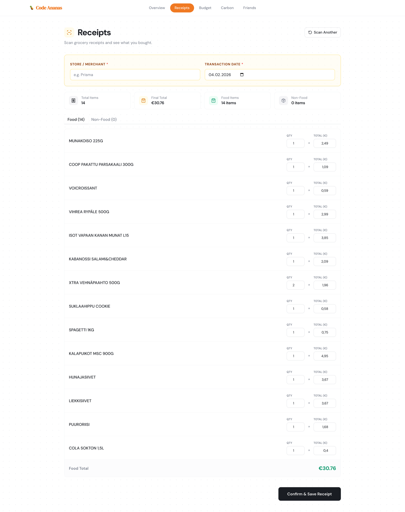

**From photo to structured data.** An upload from the dashboard is streamed through a thin Next.js proxy to an Azure Function, which first guards itself: it rejects anything that is not a real image or PDF by checking both the declared content type and the file's actual magic-byte signature, and caps the payload at 20 MB. The raw bytes are then sent to **Azure Document Intelligence** (prebuilt receipt model), which is polled until it returns line items and merchant fields plus the full OCR text.

**Solving the Finnish mess.** Dates are the first hard problem — the pipeline uses a waterfall: trust the model's date field first, then scan the raw text with a day-month-year pattern, then as a last resort derive a date from the bank reference (*viite*) number. If nothing works it refuses to guess "today" and instead asks the user for a date. Finnish discount lines and bottle-deposit rows are recognized by keyword and folded into the correct item so prices reconstruct correctly. Every monetary value is normalized to euros using historical exchange rates for the receipt's own date, with a static rate table as a network fallback.

**AI enrichment.** The cleaned items are sent to **Azure OpenAI**, which classifies each one as food or non-food, corrects OCR typos, translates Finnish names to a canonical English label, assigns a carbon-footprint category, and estimates line weight. Classification is *fail-closed* — an item only counts as food if the model explicitly says so — so a truncated response can never silently inflate food totals. Weight is also parsed deterministically from the description text (grams, kilos, litres, decilitres) as a backstop to the model's estimate.

**Duplicate defence & review.** Before saving, the receipt is fingerprinted with a content hash over normalized merchant, date, item lines, and total, then checked against past receipts. Anything ambiguous — unknown item names, unreliable prices, reconstructed totals — is flagged as *needs review* in the UI. User edits are re-validated (the total must reconcile with the item sum), and the hash is re-checked inside a transaction at save time so two concurrent uploads can't both slip in.

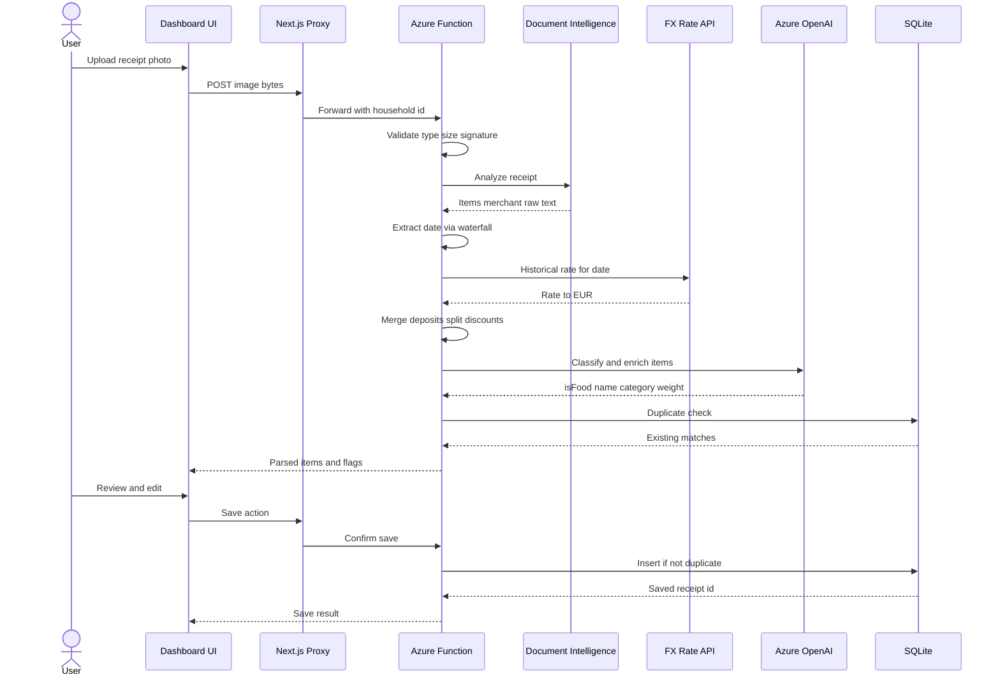

Duplicate detection runs two layers deep — an exact content-hash match can never be bypassed, while fuzzy matches (same date, total within tolerance, overlapping items) are surfaced to the user with a confidence level and can be consciously overridden:

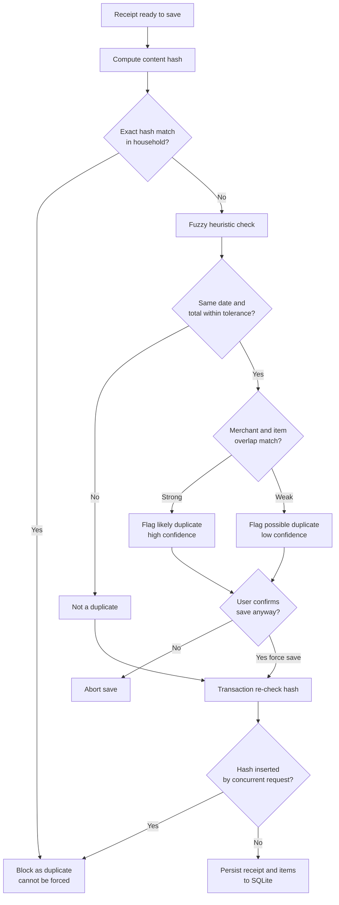

---

### 🌍 Carbon Footprint Engine

The Carbon Footprint Engine turns an ordinary grocery receipt into a per-item CO₂e estimate — and does it **deterministically**, so the same receipt always yields the same number.

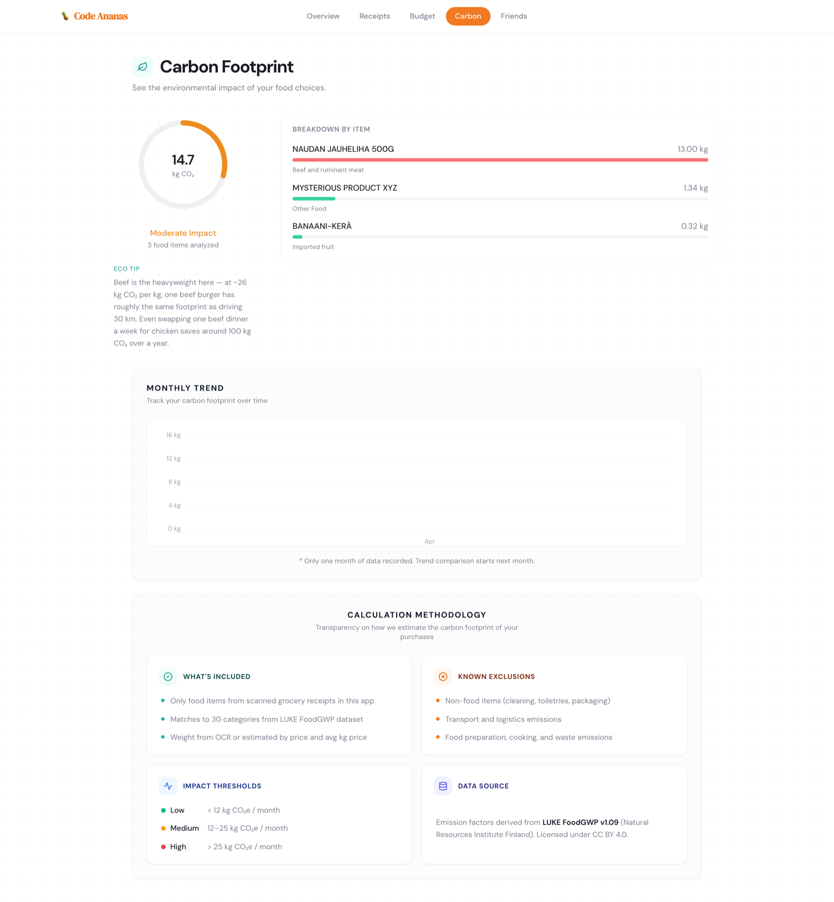

For every food line the engine matches the item to one of **30 food categories** drawn from the **LUKE FoodGWP v1.09 dataset** (Natural Resources Institute Finland, CC BY 4.0). Matching is keyword-driven against both Finnish and English product-name vocabularies, with a pre-classified category ID used directly when the scanning pipeline already tagged one. Non-food lines, price-less lines, and unnamed lines are filtered out rather than guessed at.

Weight is resolved through an ordered fallback: an explicit parsed line weight wins; a package size parsed from the product name scaled by quantity comes next; and if neither exists, weight is inferred from the line price divided by that category's average €/kg. The category's fixed emission factor then converts weight into per-item CO₂e, and lines sum to a receipt total.

Results are persisted one row per receipt, enabling **month-over-month trend aggregation** with delta and percent change, impact thresholds (**Low &lt; 12, Medium 12–25, High &gt; 25 kg CO₂e per month**), and a context-aware eco tip keyed to the household's single largest emitting category. For transparency, each stored estimate also records how many items needed fallback pricing and how many non-food items were excluded — and the full methodology (inclusions, exclusions, data source, its ±20% category-average uncertainty) is shown to the user in the UI rather than hidden.

**The defining design decision** here was replacing an earlier LLM-based estimator with this deterministic dataset lookup. An LLM can hallucinate emission factors and returns a different answer on every call; the lookup is reproducible, auditable line by line, and traceable to a published, peer-recognized dataset with explicit attribution — the right tradeoff for a number people are meant to trust and track over time.

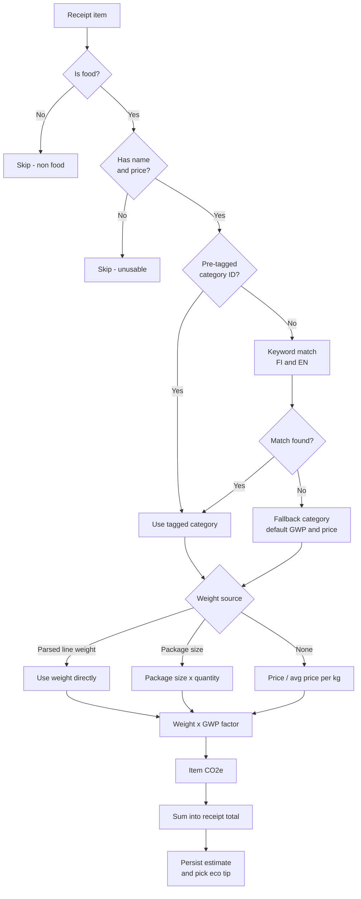

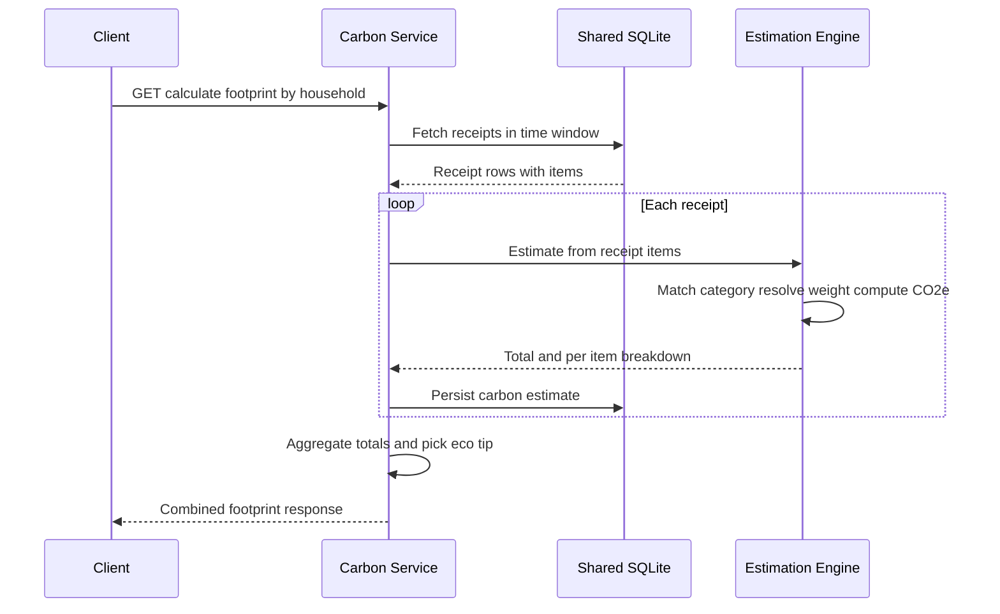

---

### 💶 Budget Engine & Shared Data Layer

Set a monthly food budget and every confirmed receipt counts against it — no manual expense entry, ever.

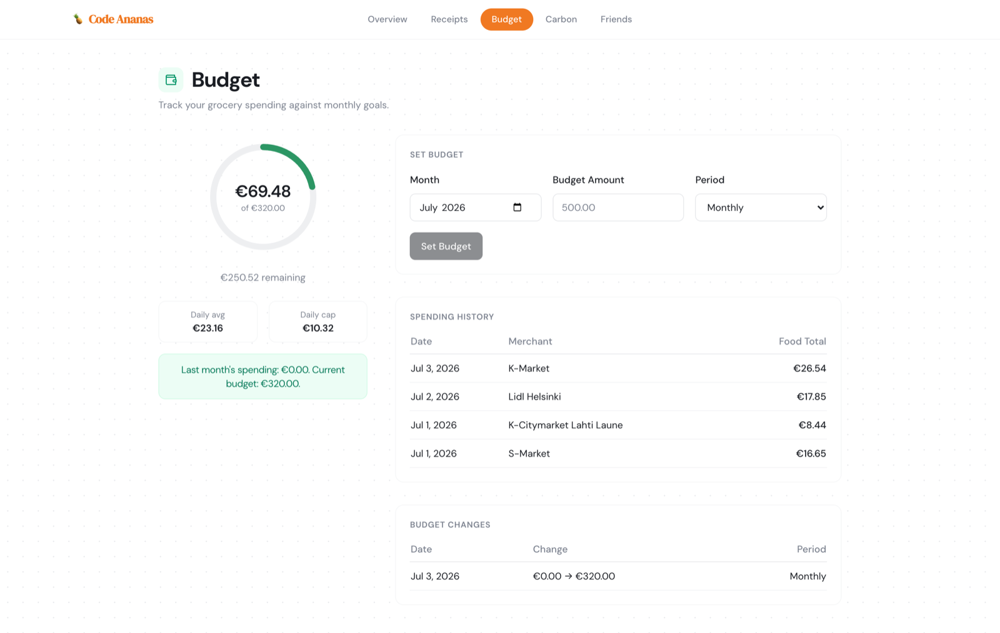

CodeAnanas runs on a **scan-once, consume-many** design. A single SQLite database, exposed through a shared internal package, is the one source of truth for the whole monorepo — receipt OCR, budget, and carbon estimation all import the same package instead of keeping private copies of the data. The package owns a singleton connection tuned for concurrent access (WAL journalling, busy-timeout, and a retry wrapper that transparently re-runs writes that hit a momentary lock), plus one idempotent schema initializer every service can safely call on startup.

Every row is **scoped to a household**. Receipts, budgets, budget history, and carbon estimates all carry a household ID, and every read filters on it — so a household only ever sees its own data. Receipts keep their line items as a flexible JSON column while surfacing rollups (food total, non-food total) as plain columns for fast aggregation, backed by composite indexes on the two hot paths: duplicate checking and monthly lookups.

The **budget engine** treats spending as a derived value — it is never stored, it is summed live from receipt food totals for the selected month. Setting a budget upserts the target on a composite month-plus-household key and writes an **audit row** capturing before/after amounts and whether the input was monthly or weekly (weekly is normalized by days-in-month). The dashboard then surfaces the math: **remaining** = budget − actual, **daily average** = spend ÷ elapsed days, **daily cap** = budget ÷ days in month — the pace needed to stay on target.

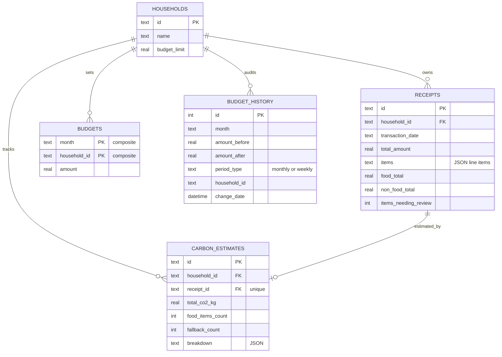

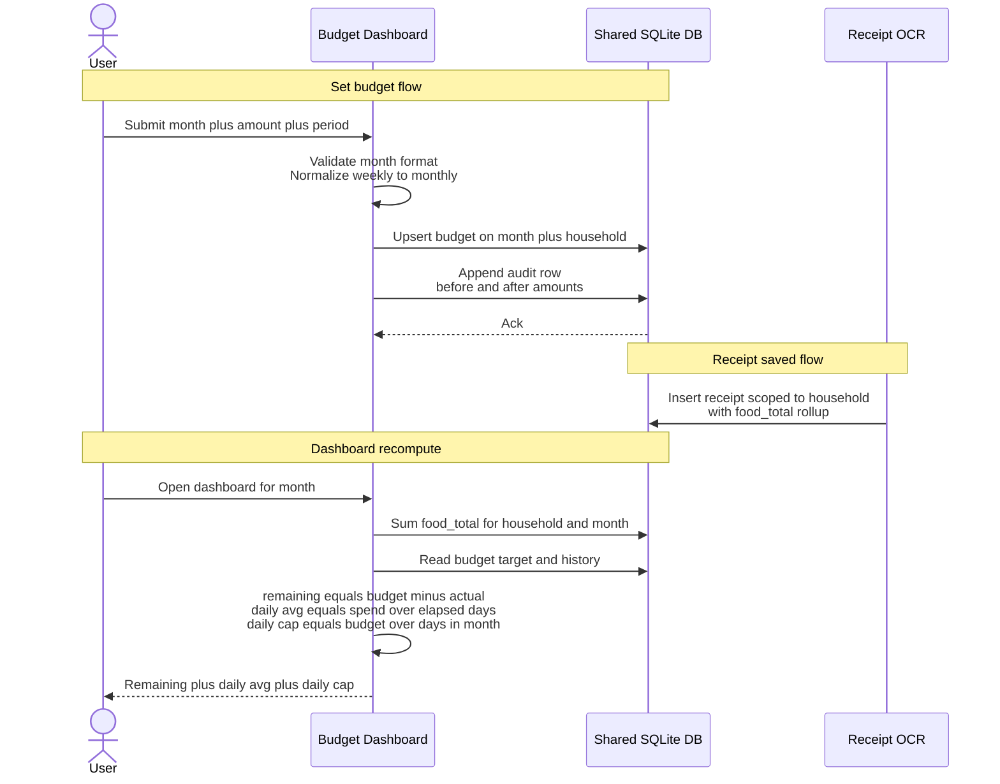

---

### 🖥 Unified Dashboard

A single Next.js (App Router) dashboard unifies the four backend services behind one calm, cohesive UI — five routes (Overview, Receipts, Budget, Carbon, Friends) in a shared app shell with a sticky top-nav, a React Query data layer, and consistent per-service accent colors.

**UX robustness** was a first-class requirement, not an afterthought. Every service page handles its own edge cases — loading states, empty "ready to calculate" states, and human-readable error banners that name the exact service and port to check when something is down. Client input is validated before it leaves the browser, and the proxy layer translates network failures into structured errors the UI can render meaningfully.

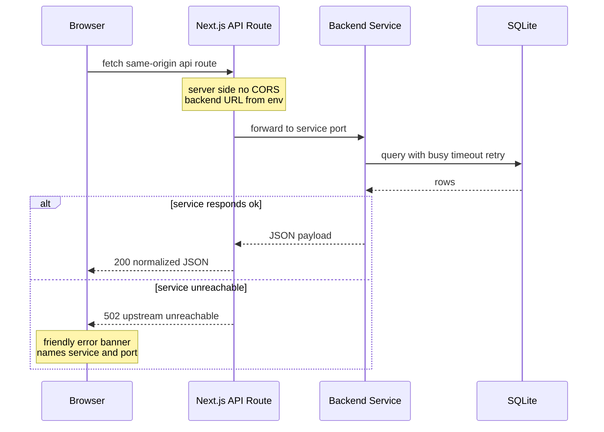

The **Overview page** is a hand-built marketing surface: a watercolor-toned hero with word-by-word spring-animated rotating copy, floating "fridge scan" and "meal plan" cards, an infinite marquee ticker, and count-up stat animations — all powered by framer-motion and gated behind `prefers-reduced-motion` for accessibility.

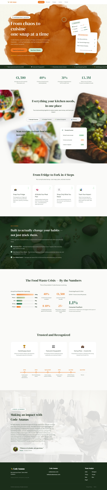

---

### 👥 Friends & Community

Add cooking friends, track their skill progression (Beginner → Chef Level, with Silver/Gold Cook badges), and share recipes across cuisines. Search spans friends, cuisines, and recipes — with full Unicode support (宮保鸡丁 works just fine).

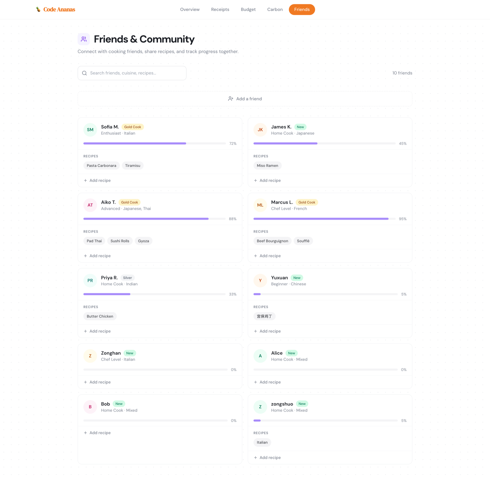

---

## My contributions

This was a team capstone; I authored **62 of the project's 94 commits (~66%)** and owned the following end to end:

| Area | What I built |
|---|---|
| 📸 Receipt OCR pipeline | Finnish receipt support, date-extraction waterfall, currency normalization, AI item enrichment, fail-closed food classification, weight parsing, two-layer duplicate detection with race-safe saves |
| 🌍 Carbon engine | Replaced LLM estimation with the deterministic LUKE FoodGWP v1.09 lookup, 30-category matching, weight-resolution fallback chain, per-receipt persistence, monthly trends, methodology transparency UI |
| 🖥 Unified dashboard | The entire Next.js app — five pages, BFF proxy layer, React Query data layer, error/edge-case handling, ring-chart carbon UI, friends redesign |
| 🗄 Data layer | Shared database package integration, schema migrations, household scoping across all tables, budget-history audit trail, concurrency hardening |
| 🏗 Platform & DX | npm-workspaces monorepo reorganization, one-command dev orchestration with port cleanup and Azurite auto-start, single-source `.env` credential generation |
| 🎨 Landing page | Watercolor hero, spring animations, marquee ticker, reduced-motion accessibility |

## Tech stack

`Next.js` · `React` · `React Query` · `TypeScript` · `Node.js` · `Azure Functions` · `Azure AI Document Intelligence` · `Azure OpenAI` · `Express.js` · `SQLite` · `framer-motion` · `npm workspaces`

---

*Screenshots and diagrams are from a live local run of the full system. Emission factors: LUKE FoodGWP v1.09, Natural Resources Institute Finland, CC BY 4.0.*
